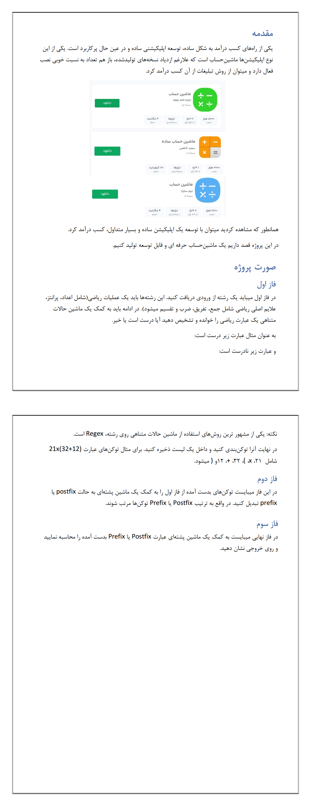

# **🧮 Advanced Calculator Using Finite State Machine & Push Down Automata Project | پروژه ماشین حساب پیشرفته با استفاده از ماشین حالت محدود و ماشین پشته‌ای**

**A university project in which an advanced calculator is implemented using finite state machine and push down automata.**

**یک پروژه دانشگاهی که در آن یک ماشین حساب پیشرفته با استفاده از ماشین حالت محدود و ماشین پشته‌ای پیاده‌سازی میشود.**

# 💬 **نکات پروژه**

* برای اجرا برنامه، به پایتون بالاتر از نسخه 3.6 نیاز دارید.
* گزارش و عکس‌های برنامه در دایرکتوری Report قرار دارد.
* منابع استفاده‌شده در دایرکتوری Sources قرار دارند.
* نمونه خروجی برنامه در فایل results.txt قرار دارد.
* کتابخانه‌های مورد نیاز در فایل requirements.txt قرار دارند.
* برای دسترسی به همه‌ی پروژه‌های دانشگاهی من، به این لینک مراجعه کنید:

👈🏻 **[پروژه‌های دانشگاهی من](https://github.com/bestmahdi2/Uni__Bachelors_SKU_Path)**

# 📝 **توضیحات پروژه**

